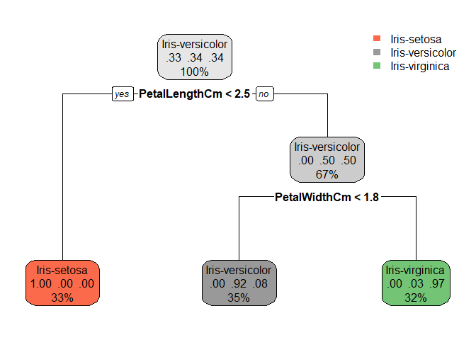

Prediction Using Decision Tree Algorithm
================

#### Decision Tree Algorithm

##### Importing and reading IRIS Dataset

``` r
data <- read.csv("Iris.csv")
head(data)
```

    ##   Id SepalLengthCm SepalWidthCm PetalLengthCm PetalWidthCm     Species
    ## 1  1           5.1          3.5           1.4          0.2 Iris-setosa
    ## 2  2           4.9          3.0           1.4          0.2 Iris-setosa
    ## 3  3           4.7          3.2           1.3          0.2 Iris-setosa
    ## 4  4           4.6          3.1           1.5          0.2 Iris-setosa
    ## 5  5           5.0          3.6           1.4          0.2 Iris-setosa
    ## 6  6           5.4          3.9           1.7          0.4 Iris-setosa

#### Summary of the dataset

``` r
summary(data)
```

    ##        Id         SepalLengthCm    SepalWidthCm   PetalLengthCm  
    ##  Min.   :  1.00   Min.   :4.300   Min.   :2.000   Min.   :1.000  
    ##  1st Qu.: 38.25   1st Qu.:5.100   1st Qu.:2.800   1st Qu.:1.600  
    ##  Median : 75.50   Median :5.800   Median :3.000   Median :4.350  
    ##  Mean   : 75.50   Mean   :5.843   Mean   :3.054   Mean   :3.759  
    ##  3rd Qu.:112.75   3rd Qu.:6.400   3rd Qu.:3.300   3rd Qu.:5.100  
    ##  Max.   :150.00   Max.   :7.900   Max.   :4.400   Max.   :6.900  
    ##   PetalWidthCm              Species  
    ##  Min.   :0.100   Iris-setosa    :50  
    ##  1st Qu.:0.300   Iris-versicolor:50  
    ##  Median :1.300   Iris-virginica :50  
    ##  Mean   :1.199                       
    ##  3rd Qu.:1.800                       
    ##  Max.   :2.500

``` r
str(data)
```

    ## 'data.frame':    150 obs. of  6 variables:
    ##  $ Id           : int  1 2 3 4 5 6 7 8 9 10 ...
    ##  $ SepalLengthCm: num  5.1 4.9 4.7 4.6 5 5.4 4.6 5 4.4 4.9 ...
    ##  $ SepalWidthCm : num  3.5 3 3.2 3.1 3.6 3.9 3.4 3.4 2.9 3.1 ...
    ##  $ PetalLengthCm: num  1.4 1.4 1.3 1.5 1.4 1.7 1.4 1.5 1.4 1.5 ...
    ##  $ PetalWidthCm : num  0.2 0.2 0.2 0.2 0.2 0.4 0.3 0.2 0.2 0.1 ...
    ##  $ Species      : Factor w/ 3 levels "Iris-setosa",..: 1 1 1 1 1 1 1 1 1 1 ...

##### Extracting Features from the dataset

``` r
keeps <- c("SepalLengthCm","SepalWidthCm","PetalLengthCm","PetalWidthCm","Species")
df = data[keeps]
head(df)
```

    ##   SepalLengthCm SepalWidthCm PetalLengthCm PetalWidthCm     Species
    ## 1           5.1          3.5           1.4          0.2 Iris-setosa
    ## 2           4.9          3.0           1.4          0.2 Iris-setosa
    ## 3           4.7          3.2           1.3          0.2 Iris-setosa
    ## 4           4.6          3.1           1.5          0.2 Iris-setosa
    ## 5           5.0          3.6           1.4          0.2 Iris-setosa
    ## 6           5.4          3.9           1.7          0.4 Iris-setosa

##### Loading the required library rpart for the decision tree

``` r
library("rpart")
```

    ## Warning: package 'rpart' was built under R version 3.5.3

``` r
library("rpart.plot")
```

##### Splitting dataset in training and the testing set.

``` r
indexes = sample(150, 110)
iris_train = df[indexes,]
iris_test = df[-indexes,]
iris_train
```

    ##     SepalLengthCm SepalWidthCm PetalLengthCm PetalWidthCm         Species
    ## 137           6.3          3.4           5.6          2.4  Iris-virginica
    ## 54            5.5          2.3           4.0          1.3 Iris-versicolor
    ## 7             4.6          3.4           1.4          0.3     Iris-setosa
    ## 1             5.1          3.5           1.4          0.2     Iris-setosa
    ## 27            5.0          3.4           1.6          0.4     Iris-setosa
    ## 104           6.3          2.9           5.6          1.8  Iris-virginica
    ## 107           4.9          2.5           4.5          1.7  Iris-virginica
    ## 105           6.5          3.0           5.8          2.2  Iris-virginica
    ## 36            5.0          3.2           1.2          0.2     Iris-setosa
    ## 72            6.1          2.8           4.0          1.3 Iris-versicolor
    ## 111           6.5          3.2           5.1          2.0  Iris-virginica
    ## 133           6.4          2.8           5.6          2.2  Iris-virginica
    ## 93            5.8          2.6           4.0          1.2 Iris-versicolor
    ## 4             4.6          3.1           1.5          0.2     Iris-setosa
    ## 55            6.5          2.8           4.6          1.5 Iris-versicolor
    ## 58            4.9          2.4           3.3          1.0 Iris-versicolor
    ## 136           7.7          3.0           6.1          2.3  Iris-virginica
    ## 45            5.1          3.8           1.9          0.4     Iris-setosa
    ## 78            6.7          3.0           5.0          1.7 Iris-versicolor
    ## 3             4.7          3.2           1.3          0.2     Iris-setosa
    ## 103           7.1          3.0           5.9          2.1  Iris-virginica
    ## 127           6.2          2.8           4.8          1.8  Iris-virginica
    ## 68            5.8          2.7           4.1          1.0 Iris-versicolor
    ## 53            6.9          3.1           4.9          1.5 Iris-versicolor
    ## 148           6.5          3.0           5.2          2.0  Iris-virginica
    ## 24            5.1          3.3           1.7          0.5     Iris-setosa
    ## 83            5.8          2.7           3.9          1.2 Iris-versicolor
    ## 37            5.5          3.5           1.3          0.2     Iris-setosa
    ## 22            5.1          3.7           1.5          0.4     Iris-setosa
    ## 141           6.7          3.1           5.6          2.4  Iris-virginica
    ## 109           6.7          2.5           5.8          1.8  Iris-virginica
    ## 108           7.3          2.9           6.3          1.8  Iris-virginica
    ## 98            6.2          2.9           4.3          1.3 Iris-versicolor
    ## 95            5.6          2.7           4.2          1.3 Iris-versicolor
    ## 135           6.1          2.6           5.6          1.4  Iris-virginica
    ## 71            5.9          3.2           4.8          1.8 Iris-versicolor
    ## 74            6.1          2.8           4.7          1.2 Iris-versicolor
    ## 75            6.4          2.9           4.3          1.3 Iris-versicolor
    ## 101           6.3          3.3           6.0          2.5  Iris-virginica
    ## 99            5.1          2.5           3.0          1.1 Iris-versicolor
    ## 88            6.3          2.3           4.4          1.3 Iris-versicolor
    ## 138           6.4          3.1           5.5          1.8  Iris-virginica
    ## 129           6.4          2.8           5.6          2.1  Iris-virginica
    ## 60            5.2          2.7           3.9          1.4 Iris-versicolor
    ## 106           7.6          3.0           6.6          2.1  Iris-virginica
    ## 142           6.9          3.1           5.1          2.3  Iris-virginica
    ## 77            6.8          2.8           4.8          1.4 Iris-versicolor
    ## 69            6.2          2.2           4.5          1.5 Iris-versicolor
    ## 46            4.8          3.0           1.4          0.3     Iris-setosa
    ## 44            5.0          3.5           1.6          0.6     Iris-setosa
    ## 23            4.6          3.6           1.0          0.2     Iris-setosa
    ## 34            5.5          4.2           1.4          0.2     Iris-setosa
    ## 64            6.1          2.9           4.7          1.4 Iris-versicolor
    ## 57            6.3          3.3           4.7          1.6 Iris-versicolor
    ## 65            5.6          2.9           3.6          1.3 Iris-versicolor
    ## 16            5.7          4.4           1.5          0.4     Iris-setosa
    ## 145           6.7          3.3           5.7          2.5  Iris-virginica
    ## 132           7.9          3.8           6.4          2.0  Iris-virginica
    ## 134           6.3          2.8           5.1          1.5  Iris-virginica
    ## 82            5.5          2.4           3.7          1.0 Iris-versicolor
    ## 97            5.7          2.9           4.2          1.3 Iris-versicolor
    ## 20            5.1          3.8           1.5          0.3     Iris-setosa
    ## 40            5.1          3.4           1.5          0.2     Iris-setosa
    ## 146           6.7          3.0           5.2          2.3  Iris-virginica
    ## 14            4.3          3.0           1.1          0.1     Iris-setosa
    ## 102           5.8          2.7           5.1          1.9  Iris-virginica
    ## 70            5.6          2.5           3.9          1.1 Iris-versicolor
    ## 19            5.7          3.8           1.7          0.3     Iris-setosa
    ## 149           6.2          3.4           5.4          2.3  Iris-virginica
    ## 117           6.5          3.0           5.5          1.8  Iris-virginica
    ## 91            5.5          2.6           4.4          1.2 Iris-versicolor
    ## 96            5.7          3.0           4.2          1.2 Iris-versicolor
    ## 8             5.0          3.4           1.5          0.2     Iris-setosa
    ## 10            4.9          3.1           1.5          0.1     Iris-setosa
    ## 38            4.9          3.1           1.5          0.1     Iris-setosa
    ## 126           7.2          3.2           6.0          1.8  Iris-virginica
    ## 25            4.8          3.4           1.9          0.2     Iris-setosa
    ## 31            4.8          3.1           1.6          0.2     Iris-setosa
    ## 147           6.3          2.5           5.0          1.9  Iris-virginica
    ## 87            6.7          3.1           4.7          1.5 Iris-versicolor
    ## 150           5.9          3.0           5.1          1.8  Iris-virginica
    ## 39            4.4          3.0           1.3          0.2     Iris-setosa
    ## 89            5.6          3.0           4.1          1.3 Iris-versicolor
    ## 35            4.9          3.1           1.5          0.1     Iris-setosa
    ## 112           6.4          2.7           5.3          1.9  Iris-virginica
    ## 122           5.6          2.8           4.9          2.0  Iris-virginica
    ## 140           6.9          3.1           5.4          2.1  Iris-virginica
    ## 76            6.6          3.0           4.4          1.4 Iris-versicolor
    ## 123           7.7          2.8           6.7          2.0  Iris-virginica
    ## 33            5.2          4.1           1.5          0.1     Iris-setosa
    ## 92            6.1          3.0           4.6          1.4 Iris-versicolor
    ## 28            5.2          3.5           1.5          0.2     Iris-setosa
    ## 11            5.4          3.7           1.5          0.2     Iris-setosa
    ## 118           7.7          3.8           6.7          2.2  Iris-virginica
    ## 144           6.8          3.2           5.9          2.3  Iris-virginica
    ## 52            6.4          3.2           4.5          1.5 Iris-versicolor
    ## 100           5.7          2.8           4.1          1.3 Iris-versicolor
    ## 47            5.1          3.8           1.6          0.2     Iris-setosa
    ## 62            5.9          3.0           4.2          1.5 Iris-versicolor
    ## 42            4.5          2.3           1.3          0.3     Iris-setosa
    ## 128           6.1          3.0           4.9          1.8  Iris-virginica
    ## 116           6.4          3.2           5.3          2.3  Iris-virginica
    ## 73            6.3          2.5           4.9          1.5 Iris-versicolor
    ## 18            5.1          3.5           1.4          0.3     Iris-setosa
    ## 81            5.5          2.4           3.8          1.1 Iris-versicolor
    ## 5             5.0          3.6           1.4          0.2     Iris-setosa
    ## 15            5.8          4.0           1.2          0.2     Iris-setosa
    ## 49            5.3          3.7           1.5          0.2     Iris-setosa
    ## 2             4.9          3.0           1.4          0.2     Iris-setosa
    ## 90            5.5          2.5           4.0          1.3 Iris-versicolor

``` r
iris_test
```

    ##     SepalLengthCm SepalWidthCm PetalLengthCm PetalWidthCm         Species
    ## 6             5.4          3.9           1.7          0.4     Iris-setosa
    ## 9             4.4          2.9           1.4          0.2     Iris-setosa
    ## 12            4.8          3.4           1.6          0.2     Iris-setosa
    ## 13            4.8          3.0           1.4          0.1     Iris-setosa
    ## 17            5.4          3.9           1.3          0.4     Iris-setosa
    ## 21            5.4          3.4           1.7          0.2     Iris-setosa
    ## 26            5.0          3.0           1.6          0.2     Iris-setosa
    ## 29            5.2          3.4           1.4          0.2     Iris-setosa
    ## 30            4.7          3.2           1.6          0.2     Iris-setosa
    ## 32            5.4          3.4           1.5          0.4     Iris-setosa
    ## 41            5.0          3.5           1.3          0.3     Iris-setosa
    ## 43            4.4          3.2           1.3          0.2     Iris-setosa
    ## 48            4.6          3.2           1.4          0.2     Iris-setosa
    ## 50            5.0          3.3           1.4          0.2     Iris-setosa
    ## 51            7.0          3.2           4.7          1.4 Iris-versicolor
    ## 56            5.7          2.8           4.5          1.3 Iris-versicolor
    ## 59            6.6          2.9           4.6          1.3 Iris-versicolor
    ## 61            5.0          2.0           3.5          1.0 Iris-versicolor
    ## 63            6.0          2.2           4.0          1.0 Iris-versicolor
    ## 66            6.7          3.1           4.4          1.4 Iris-versicolor
    ## 67            5.6          3.0           4.5          1.5 Iris-versicolor
    ## 79            6.0          2.9           4.5          1.5 Iris-versicolor
    ## 80            5.7          2.6           3.5          1.0 Iris-versicolor
    ## 84            6.0          2.7           5.1          1.6 Iris-versicolor
    ## 85            5.4          3.0           4.5          1.5 Iris-versicolor
    ## 86            6.0          3.4           4.5          1.6 Iris-versicolor
    ## 94            5.0          2.3           3.3          1.0 Iris-versicolor
    ## 110           7.2          3.6           6.1          2.5  Iris-virginica
    ## 113           6.8          3.0           5.5          2.1  Iris-virginica
    ## 114           5.7          2.5           5.0          2.0  Iris-virginica
    ## 115           5.8          2.8           5.1          2.4  Iris-virginica
    ## 119           7.7          2.6           6.9          2.3  Iris-virginica
    ## 120           6.0          2.2           5.0          1.5  Iris-virginica
    ## 121           6.9          3.2           5.7          2.3  Iris-virginica
    ## 124           6.3          2.7           4.9          1.8  Iris-virginica
    ## 125           6.7          3.3           5.7          2.1  Iris-virginica
    ## 130           7.2          3.0           5.8          1.6  Iris-virginica
    ## 131           7.4          2.8           6.1          1.9  Iris-virginica
    ## 139           6.0          3.0           4.8          1.8  Iris-virginica
    ## 143           5.8          2.7           5.1          1.9  Iris-virginica

##### Setting taret value and input for the tree

``` r
target = Species ~  PetalLengthCm+ PetalWidthCm+SepalLengthCm + SepalWidthCm 
tree = rpart(target, data = iris_train, method = "class")
rpart.plot(tree)
```

<!-- -->

##### Now once the model is built we can test it against the test set and predict the species

``` r
predictions = predict(tree, iris_test,type='class')
table(predictions, iris_test$Species)
```

    ##                  
    ## predictions       Iris-setosa Iris-versicolor Iris-virginica
    ##   Iris-setosa              14               0              0
    ##   Iris-versicolor           0              13              2
    ##   Iris-virginica            0               0             11

``` r
predictions
```

    ##               6               9              12              13 
    ##     Iris-setosa     Iris-setosa     Iris-setosa     Iris-setosa 
    ##              17              21              26              29 
    ##     Iris-setosa     Iris-setosa     Iris-setosa     Iris-setosa 
    ##              30              32              41              43 
    ##     Iris-setosa     Iris-setosa     Iris-setosa     Iris-setosa 
    ##              48              50              51              56 
    ##     Iris-setosa     Iris-setosa Iris-versicolor Iris-versicolor 
    ##              59              61              63              66 
    ## Iris-versicolor Iris-versicolor Iris-versicolor Iris-versicolor 
    ##              67              79              80              84 
    ## Iris-versicolor Iris-versicolor Iris-versicolor Iris-versicolor 
    ##              85              86              94             110 
    ## Iris-versicolor Iris-versicolor Iris-versicolor  Iris-virginica 
    ##             113             114             115             119 
    ##  Iris-virginica  Iris-virginica  Iris-virginica  Iris-virginica 
    ##             120             121             124             125 
    ## Iris-versicolor  Iris-virginica  Iris-virginica  Iris-virginica 
    ##             130             131             139             143 
    ## Iris-versicolor  Iris-virginica  Iris-virginica  Iris-virginica 
    ## Levels: Iris-setosa Iris-versicolor Iris-virginica

``` r
(predictions == iris_test$Species)
```

    ##  [1]  TRUE  TRUE  TRUE  TRUE  TRUE  TRUE  TRUE  TRUE  TRUE  TRUE  TRUE
    ## [12]  TRUE  TRUE  TRUE  TRUE  TRUE  TRUE  TRUE  TRUE  TRUE  TRUE  TRUE
    ## [23]  TRUE  TRUE  TRUE  TRUE  TRUE  TRUE  TRUE  TRUE  TRUE  TRUE FALSE
    ## [34]  TRUE  TRUE  TRUE FALSE  TRUE  TRUE  TRUE

``` r
sum(predictions == iris_test$Species)
```

    ## [1] 38

``` r
cp <- sum(predictions == iris_test$Species)
sprintf("No. of correct predictions : %i", cp)
```

    ## [1] "No. of correct predictions : 38"
