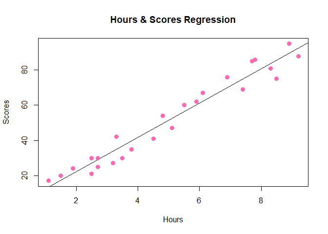

Prediction using supervised ML
================

### GRIP TASK 1

#### TASK 1 : Student Marks Dataset

##### Reading The dataset

``` r
data <- read.csv("studentMarksDataset.csv")
print(data)
```

    ##    Hours Scores
    ## 1    2.5     21
    ## 2    5.1     47
    ## 3    3.2     27
    ## 4    8.5     75
    ## 5    3.5     30
    ## 6    1.5     20
    ## 7    9.2     88
    ## 8    5.5     60
    ## 9    8.3     81
    ## 10   2.7     25
    ## 11   7.7     85
    ## 12   5.9     62
    ## 13   4.5     41
    ## 14   3.3     42
    ## 15   1.1     17
    ## 16   8.9     95
    ## 17   2.5     30
    ## 18   1.9     24
    ## 19   6.1     67
    ## 20   7.4     69
    ## 21   2.7     30
    ## 22   4.8     54
    ## 23   3.8     35
    ## 24   6.9     76
    ## 25   7.8     86

##### Summary of the dataset

``` r
summary(data)
```

    ##      Hours           Scores     
    ##  Min.   :1.100   Min.   :17.00  
    ##  1st Qu.:2.700   1st Qu.:30.00  
    ##  Median :4.800   Median :47.00  
    ##  Mean   :5.012   Mean   :51.48  
    ##  3rd Qu.:7.400   3rd Qu.:75.00  
    ##  Max.   :9.200   Max.   :95.00

##### Extracting Variables from the dataset

``` r
hours <- data$Hours
scores <- data$Scores
print(hours)
```

    ##  [1] 2.5 5.1 3.2 8.5 3.5 1.5 9.2 5.5 8.3 2.7 7.7 5.9 4.5 3.3 1.1 8.9 2.5
    ## [18] 1.9 6.1 7.4 2.7 4.8 3.8 6.9 7.8

``` r
print(scores)
```

    ##  [1] 21 47 27 75 30 20 88 60 81 25 85 62 41 42 17 95 30 24 67 69 30 54 35
    ## [24] 76 86

##### Creating a the LINEAR REGRESSION MODEL for the dataset

``` r
SMmodel <- lm(scores~hours)
SMmodel
```

    ## 
    ## Call:
    ## lm(formula = scores ~ hours)
    ## 
    ## Coefficients:
    ## (Intercept)        hours  
    ##       2.484        9.776

##### Visualizing the Plot for the model

``` r
plot(hours,scores,col = "hotpink",main = "Hours & Scores Regression",
abline(SMmodel),cex = 1.3,pch = 16,xlab = "Hours",ylab = "Scores")
```

<!-- -->

###### Let’s predict the Score of a student according to the given study hours..

###### Predicting the Score taking the study hours to be 9.25hrs

``` r
pred<-data.frame(hours=9.25)
res<- predict(SMmodel,pred)
print(res)
```

    ##        1 
    ## 92.90985
