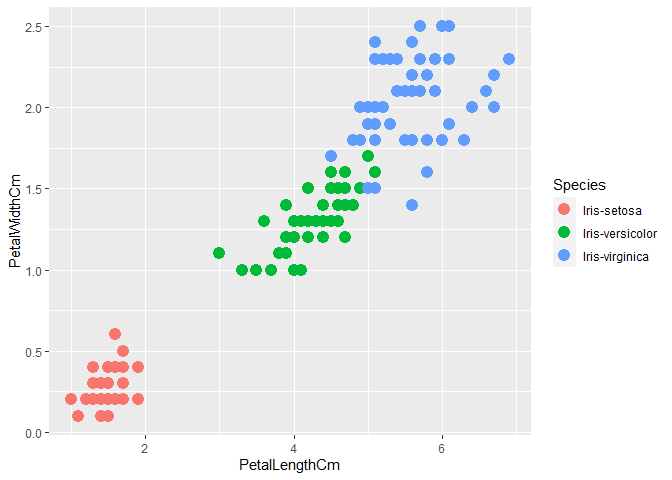
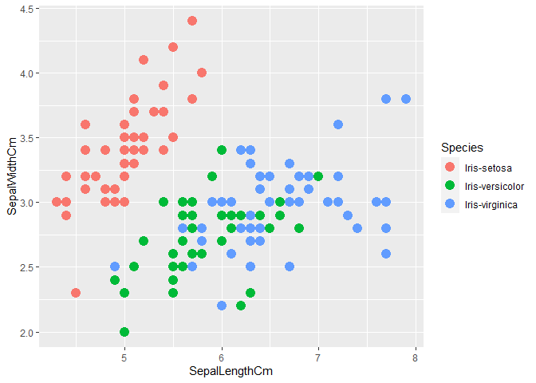
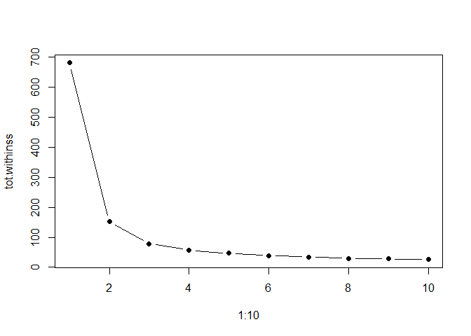
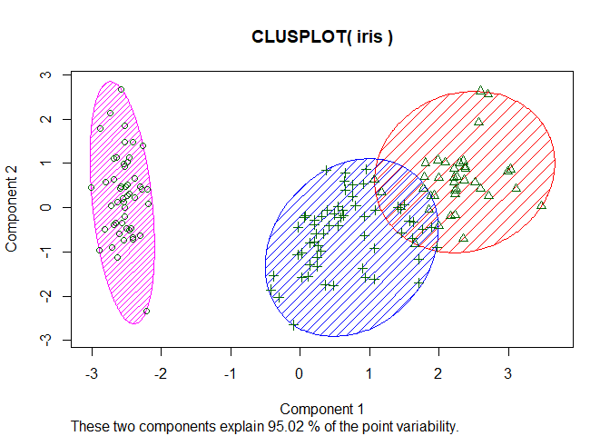

Prediction using Unsupervised ML
================

#### Importing and reading IRIS Dataset

``` r
data <- read.csv("Iris.csv")
head(data)
```

    ##   Id SepalLengthCm SepalWidthCm PetalLengthCm PetalWidthCm     Species
    ## 1  1           5.1          3.5           1.4          0.2 Iris-setosa
    ## 2  2           4.9          3.0           1.4          0.2 Iris-setosa
    ## 3  3           4.7          3.2           1.3          0.2 Iris-setosa
    ## 4  4           4.6          3.1           1.5          0.2 Iris-setosa
    ## 5  5           5.0          3.6           1.4          0.2 Iris-setosa
    ## 6  6           5.4          3.9           1.7          0.4 Iris-setosa

#### Summary of the dataset

``` r
summary(data)
```

    ##        Id         SepalLengthCm    SepalWidthCm   PetalLengthCm  
    ##  Min.   :  1.00   Min.   :4.300   Min.   :2.000   Min.   :1.000  
    ##  1st Qu.: 38.25   1st Qu.:5.100   1st Qu.:2.800   1st Qu.:1.600  
    ##  Median : 75.50   Median :5.800   Median :3.000   Median :4.350  
    ##  Mean   : 75.50   Mean   :5.843   Mean   :3.054   Mean   :3.759  
    ##  3rd Qu.:112.75   3rd Qu.:6.400   3rd Qu.:3.300   3rd Qu.:5.100  
    ##  Max.   :150.00   Max.   :7.900   Max.   :4.400   Max.   :6.900  
    ##   PetalWidthCm              Species  
    ##  Min.   :0.100   Iris-setosa    :50  
    ##  1st Qu.:0.300   Iris-versicolor:50  
    ##  Median :1.300   Iris-virginica :50  
    ##  Mean   :1.199                       
    ##  3rd Qu.:1.800                       
    ##  Max.   :2.500

##### Extracting Features from the dataset

``` r
keeps <- c("SepalLengthCm","SepalWidthCm","PetalLengthCm","PetalWidthCm")
df = data[keeps]
head(df)
```

    ##   SepalLengthCm SepalWidthCm PetalLengthCm PetalWidthCm
    ## 1           5.1          3.5           1.4          0.2
    ## 2           4.9          3.0           1.4          0.2
    ## 3           4.7          3.2           1.3          0.2
    ## 4           4.6          3.1           1.5          0.2
    ## 5           5.0          3.6           1.4          0.2
    ## 6           5.4          3.9           1.7          0.4

``` r
library(ggplot2)
```

    ## Warning: As of rlang 0.4.0, dplyr must be at least version 0.8.0.
    ## * dplyr 0.7.6 is too old for rlang 0.4.5.
    ## * Please update dplyr to the latest version.
    ## * Updating packages on Windows requires precautions:
    ##   <https://github.com/jennybc/what-they-forgot/issues/62>

Plotting graph between PetalLengthCm and PetalWidthCm
-----------------------------------------------------

``` r
ggplot(data, aes(PetalLengthCm, PetalWidthCm)) + geom_point(aes(col=Species), size=4)
```

<!-- -->

Plotting graph between SepalLengthCm and SepalLengthCm
------------------------------------------------------

``` r
ggplot(data, aes(SepalLengthCm, SepalWidthCm)) + geom_point(aes(col=Species), size=4)
```

<!-- -->
\#\#\#\#\# Finding the ideal number of cluster

``` r
tot.withinss <- vector(mode="character", length=10)
for (i in 1:10){
  irisCluster <- kmeans(df[,1:4], center=i, nstart=20)
  tot.withinss[i] <- irisCluster$tot.withinss
}
plot(1:10, tot.withinss, type="b", pch=19)
```

<!-- -->
\#\#\#\#To know the exact number of clusters, We have used the elbow
method…

#### Plotting the clusters and visualizing them….

``` r
library(cluster)
```

    ## Warning: package 'cluster' was built under R version 3.5.3

``` r
df <- kmeans(df[,1:4], center=3, nstart=20)

clusplot(iris, df$cluster, color=T, shade=T, labels=0, lines=0)
```

<!-- -->
